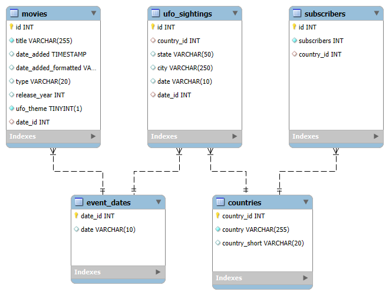

# UFO Sightings Analysis

## Project Overview
This project aims to explore the relationship between UFO sightings and Netflix movie releases. Specifically, it examines whether the release of alien-themed movies on Netflix influences the number of reported UFO sightings and whether countries with higher Netflix subscriptions report more sightings.

## Hypotheses
1. UFO sightings increase in the weeks after Netflix film releases about aliens.
2. UFO sightings are more prevalent in countries with higher Netflix subscriptions.
3. Higher-rated or more popular movies lead to more UFO sightings.

## Data Sources
The analysis is based on four datasets:
- **UFO Sightings Dataset**: Contains reported UFO sightings with timestamps and location details.
- **Netflix Movies Dataset**: Includes movie titles, genres, release dates, and descriptions.
- **Netflix Subscribers Dataset**: Tracks the number of subscribers per country.
- **Country Population Dataset**: Population per country.

## Database Setup
The project utilizes MySQL, with tables structured as follows:

- **event_dates**: Stores unique dates for indexing purposes which are used in ufo_sightings and movies.
- **countries**: Holds country names, population data, and a country index which is used in movies and subsribers
- **movies**: Contains movie metadata, including whether they are UFO-themed.
- **ufo_sightings**: Records UFO sightings, linking them to countries and dates.
- **subscribers**: Contains subscriber counts and population data per country.

### Entity-Relationship Diagram
Below is the Entity-Relationship Diagram (ERD) for the database structure:

### Database Initialization
The database is set up using SQLAlchemy. Key functions include:
1. **`create_database(connection)`** – Creates the database if it does not exist.
2. **`drop_existing_tables(connection)`** – Drops existing tables to allow for fresh data ingestion.
3. **`create_*_table(connection)`** – Functions to create each required table.
4. **`create_indexes(connection)`** – Adds indexes for optimized queries.

## Data Cleaning and Processing
### Countries Data
- Extracts country names and codes using `pycountry`.
- Merges with population data.

### Movies Data
- Filters movies related to UFOs based on keywords in descriptions.
- Formats release dates for analysis.

### UFO Sightings Data
- Cleans and formats date information.
- Standardizes country names and maps them to country codes.

### Subscribers Data
- Cleans and merges subscriber data with country information.

### Date Indexing
- Creates a structured date index to ensure accurate time-based comparisons.

## Analysis
Using SQL and Python (pandas, seaborn, statsmodels), the project explores correlations through:
- Aggregating UFO sightings per country and date.
- Mapping sightings against Netflix release dates.
- Statistical modeling to detect trends.

## Technologies Used
- **Python** (pandas, numpy, sqlalchemy, seaborn, statsmodels, matplotlib)
- **SQLAlchemy** (for database interactions)
- **MySQL** (Google Cloud SQL trial used for database hosting)

## How to Run the Project
1. Install required dependencies.
2. Set up MySQL and configure the connection using `helper.sql_engine.get_engine()`.
3. Run `setup_database.py` to create tables.
4. Clean and preprocess data.
5. Execute analysis scripts.

---

For more details, check individual scripts in the repository. Contributions and feedback are welcome!

